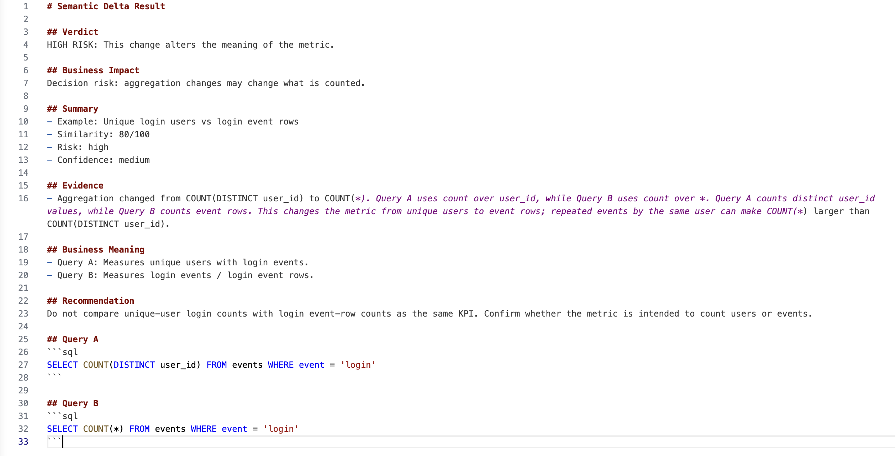

# semantic-delta-detector

## 🚨 Example: Decision Report



Same SQL. Different meaning. High-risk metric drift caught early.

## 🚨 What this solves
A dashboard can show “active users” in two places and hide two different definitions.
One team may count product logins.
Another may count paying users who were recently active.

semantic-delta-detector catches that drift before teams compare incompatible KPIs, trust the wrong chart, or make decisions from the wrong number.

## 🔍 Example (the hook)
Two SQL queries can look similar, share a metric name, and still answer different business questions.

Same metric name. Different business meaning. A dashboard mistake caught early.

## 🔍 Detailed Analysis Example

This is a more detailed breakdown of the semantic comparison output.


## 💡 What it does
- Acts as a semantic risk engine for SQL metric changes
- Identifies mismatches in business meaning
- Outputs similarity, risk, confidence, and explanation
- Can use optional metric metadata when provided

## ⚠️ Why this matters
- Misleading KPIs create false confidence
- Inconsistent dashboards erode trust between teams
- Similar metric names can hide different qualification rules
- Bad definitions lead to bad product, finance, and growth decisions

## ⚙️ How it works (simple)
- Reads two SQL-backed metric definitions
- Extracts tables, filters, time windows, and aggregations
- Infers the likely business meaning of each query
- Compares whether the definitions are safe to treat as the same metric
- Returns a compact risk report with explanation and recommendation

## Semantic Risk Examples
Same-looking SQL changes can mean different KPIs. These examples show the kinds of semantic drift the detector is designed to flag.

| Scenario | Query A meaning | Query B meaning | Risk | Why it matters |
| --- | --- | --- | --- | --- |
| Login events -> all events | Login events | All events | Medium | Removing `event = 'login'` broadens the metric from one activity to every event row. |
| Paid users -> all users | Monetized users | All users | High | Removing a paid/subscription gate changes the population behind the KPI. |
| 7-day logins -> 30-day logins | 7-day login events | 30-day login events | Medium | Same event concept, different reporting window. |
| Paid order count -> paid order revenue | Count of paid orders | Revenue from paid orders | High | Count and monetary value should not be treated as the same metric. |
| Paid orders -> paid payments | Paid order records | Paid payment records | High | Orders and payments can represent different source-of-truth lifecycles. |
| DE users -> US users | German users | US users | Medium | Same metric shape, different user cohort. |
| Joined users/orders -> all users | Users with matching orders or joined rows | All users | High | A join can exclude users without orders or multiply rows for users with many orders. |
| Unique login users -> login event rows | Unique users who logged in | Login event rows | High | Repeated events by the same user can make row counts much larger than user counts. |
| Non-deleted users -> all users | Users excluding deleted users | All users | Medium | Removing an exclusion can bring deleted users into the population. |
| External users -> all users | Users excluding internal/test accounts | All users | Medium | Internal or test accounts can distort customer/user KPIs. |
| Daily login counts -> monthly login counts | Daily login event counts | Monthly login event counts | Medium | Same activity and aggregation, but different reporting grain; daily and monthly trend points are not directly comparable. |
| LEFT JOIN users/orders -> INNER JOIN users/orders | All users with optional order matches | Users with matching order records | High | Changing LEFT JOIN to INNER JOIN can exclude users without orders and change population inclusion. |

## 🚀 Quick demo
```bash
npx semantic-delta-detector \
  --json-a ./src/examples/product-active-users.json \
  --json-b ./src/examples/finance-active-users.json \
  --demo
```

## Pull Request Simulation
Preview the kind of short review comment Semantic Delta could add to a pull request. This local mode does not call the GitHub API yet; it reads before/after SQL files and prints a PR-style risk comment.

```bash
npm run compare -- --before ./examples/pr-before.sql --after ./examples/pr-after.sql --pr
```

CI can fail on semantic risk by adding `--fail-on low|medium|high|critical`:

```bash
npm run compare -- --before ./examples/pr-before.sql --after ./examples/pr-after.sql --pr --fail-on high
```

Files used:
- `examples/pr-before.sql`
- `examples/pr-after.sql`

Example output:
```text
🔴 HIGH RISK
This change alters the meaning of the metric.

Impact: aggregation changes may change what is counted.
Evidence:
- Aggregation changed from COUNT(DISTINCT user_id) to COUNT(*).
Recommendation: Do not compare unique-user login counts with login event-row counts as the same KPI. Confirm whether the metric is intended to count users or events.
```

This is the bridge toward a future GitHub Action or PR bot.

A preview GitHub Actions workflow is included at `.github/workflows/semantic-delta-preview.yml`. It runs the local PR simulation and prints the PR-style output in CI logs. It does not comment on PRs yet.

## 🔌 VS Code Extension
Use semantic-delta-detector directly in VS Code through an extension that calls the same core comparison engine: https://github.com/Ryukanchi/semantic-delta-extension

## 🧩 Features
- Semantic risk detection for SQL metric changes
- Optional metric metadata comparison
- Similarity and risk scoring
- Confidence and evidence reporting
- Human-readable and JSON output
- Tested comparison cases for core behavior

## 🛣️ Roadmap
- Improved SQL parsing
- Richer semantic signals

## 🧠 Philosophy
- Not a SQL validator
- Not a truth engine
- Not a replacement for metric ownership
- A semantic early warning system for metric drift

## 📦 Status
MVP heuristic detector.
Core comparison logic is structured and tested; SQL understanding is intentionally heuristic and still evolving.
