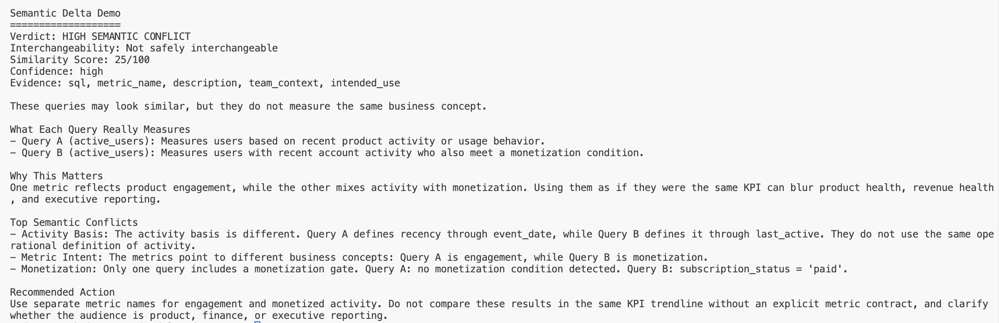

# semantic-delta-detector

## 🚨 What this solves
A dashboard can show “active users” in two places and hide two different definitions.
One team may count product logins.
Another may count paying users who were recently active.

semantic-delta-detector catches that drift before teams compare incompatible KPIs, trust the wrong chart, or make decisions from the wrong number.

## 🔍 Example (the hook)
Two SQL queries can look similar, share a metric name, and still answer different business questions.



Same metric name. Different business meaning. A dashboard mistake caught early.

## 💡 What it does
- Detects semantic differences between SQL queries
- Identifies mismatches in business meaning
- Outputs similarity, risk, confidence, and explanation
- Supports metadata-aware comparison (v2)

## ⚠️ Why this matters
- Misleading KPIs create false confidence
- Inconsistent dashboards erode trust between teams
- Similar metric names can hide different qualification rules
- Bad definitions lead to bad product, finance, and growth decisions

## ⚙️ How it works (simple)
- Reads two SQL-backed metric definitions
- Extracts tables, filters, time windows, and aggregations
- Infers the likely business meaning of each query
- Compares whether the definitions are safe to treat as the same metric
- Returns a compact risk report with explanation and recommendation

## 🚀 Quick demo
```bash
npx semantic-delta-detector \
  --json-a ./src/examples/product-active-users.json \
  --json-b ./src/examples/finance-active-users.json \
  --demo
```

## 🔌 VS Code Extension
Use semantic-delta-detector directly in VS Code through an extension that calls the same core comparison engine: https://github.com/Ryukanchi/semantic-delta-extension

## 🧩 Features
- SQL semantic comparison
- Metadata-aware comparison
- Similarity and risk scoring
- Confidence and evidence reporting
- Human-readable and JSON output
- Tested comparison cases for core behavior

## 🛣️ Roadmap
- Improved SQL parsing
- Richer semantic signals

## 🧠 Philosophy
- Not a SQL validator
- Not a truth engine
- Not a replacement for metric ownership
- A semantic early warning system for metric drift

## 📦 Status
MVP with metadata-aware comparison (v2).
Core comparison logic is structured and tested; SQL understanding is intentionally heuristic and still evolving.

## 🔌 VS Code Extension
Use the detector directly in your editor:
https://github.com/Ryukanchi/semantic-delta-extension
