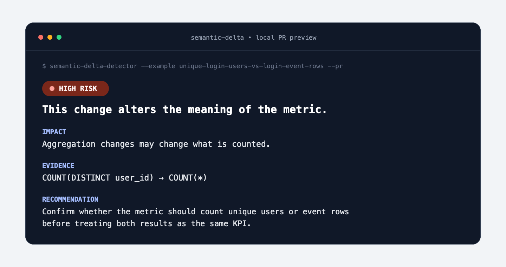
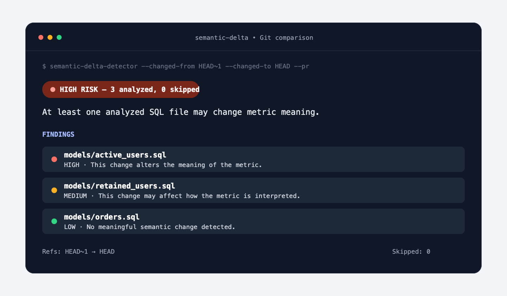

# Semantic Delta Detector

**Catch metric drift before it becomes a dashboard problem.**

`Changed SQL → Semantic Impact → Why it matters`



Semantic Delta is a local-first semantic risk detector for SQL metric changes. It compares changed SQL, explains how the business meaning may have shifted, and gives reviewers evidence and a recommended action.

It is an intentionally heuristic early-warning system—not a SQL validator, equivalence prover, or replacement for metric ownership.

## Why this exists

Two dashboards can both show “active users” while measuring different populations:

- one counts unique users who logged in;
- another counts every login event;
- another includes only recently active paying users.

The SQL may look similar, but the resulting KPIs are not interchangeable. Semantic Delta surfaces that difference before it becomes misleading reporting or a bad product, finance, or growth decision.

## Installation and quick start

Semantic Delta is tested in CI with Node.js 24. Install it in a Node.js project:

```bash
npm install semantic-delta-detector
```

The package is ESM-only. Use `import` with the root, `/core`, or `/postgresql`
entrypoint; CommonJS `require()` is not part of the v1.0 contract.

Run a bundled end-to-end example through the installed CLI:

```bash
npx semantic-delta-detector --example unique-login-users-vs-login-event-rows --pr
```

Example result:

```text
🔴 HIGH RISK
This change alters the meaning of the metric.

Impact: aggregation changes may change what is counted.
Evidence:
- Aggregation changed from COUNT(DISTINCT user_id) to COUNT(*).
Recommendation: Confirm whether the metric is intended to count users or events.
```

## Compare changed SQL between Git refs

The primary workflow compares changed SQL files between two local Git refs:

```bash
npx semantic-delta-detector \
  --changed-from origin/main \
  --changed-to HEAD \
  --repo ../analytics-repo
```

`--changed-from` is always required. Semantic Delta does not guess a base branch. `--changed-to` defaults to `HEAD`, and `--repo` defaults to the current directory.

The Git workflow is:

```text
Git refs
→ changed-file discovery
→ include/ignore filtering
→ conservative before/after pairing
→ semantic comparison per file
→ aggregate report
→ optional severity gate
```



Git mode:

- analyzes modified SQL files and complete renames;
- preserves exact before/after paths for renamed files;
- reports added, deleted, copied, filtered, malformed, or unreadable records as explicit skips;
- preserves ordering and duplicate records;
- guarantees that every discovered record is either analyzed or skipped;
- derives aggregate severity only from files that were actually analyzed.

When no `include` rules are configured, Git mode considers `**/*.sql`. `ignore` rules take precedence over `include` rules.

## Output modes

### Readable aggregate report

```bash
npx semantic-delta-detector --changed-from origin/main --changed-to HEAD
```

### Simulated PR-style report

```bash
npx semantic-delta-detector --changed-from origin/main --changed-to HEAD --pr
```

This prints a concise preview only. It does not post a pull-request comment or call the GitHub API.

### Complete JSON report

```bash
npx semantic-delta-detector \
  --changed-from origin/main \
  --changed-to HEAD \
  --format json
```

JSON retains resolved refs, analyzed findings, skipped records, warnings, and accounting totals.

### Optional severity gating

```bash
npx semantic-delta-detector \
  --changed-from origin/main \
  --changed-to HEAD \
  --fail-on high
```

Supported thresholds are `low`, `medium`, `high`, and `critical`. The gate uses the highest severity among analyzed files. Skipped files do not trigger semantic failure, and a run with no comparable files exits calmly unless an operational error occurred.

Operational errors remain distinct from semantic gate failures.

## Repository configuration

Create `semantic-delta.yml` in the repository being analyzed:

```yaml
fail_on: high
default_before_path: ./examples/pr-before.sql
default_after_path: ./examples/pr-after.sql
include:
  - metrics/**
  - models/**
ignore:
  - docs/**
  - README.md
```

Precedence and scope:

- CLI `--fail-on` overrides config `fail_on`.
- CLI `--before` and `--after` override `default_before_path` and `default_after_path`.
- `include` and `ignore` apply only to local Git comparison mode.
- Explicit before/after comparisons are not filtered by Git path rules.

## Compare two definitions directly

Semantic Delta also supports explicit pairs and bundled examples:

```bash
# SQL files
npx semantic-delta-detector --file-a ./query-a.sql --file-b ./query-b.sql

# PR-style before/after preview
npx semantic-delta-detector \
  --before ./before.sql \
  --after ./after.sql \
  --pr

# Inline SQL
npx semantic-delta-detector \
  --query-a "SELECT COUNT(DISTINCT user_id) FROM events" \
  --query-b "SELECT COUNT(*) FROM events"

# Bundled low-risk example
npx semantic-delta-detector --example same-de-users-formatting --pr
```

JSON metric definitions may optionally add `metric_name`, `description`, `team_context`, and `intended_use` alongside the SQL query.

## What the analyzer looks for

Semantic Delta currently reasons about signals such as:

| Change | Example semantic risk |
| --- | --- |
| Aggregation | Unique users become event rows |
| Multiple aggregations | One measure inside a multi-metric SELECT changes |
| Population filter | Paid users become all users |
| Time window | 7-day activity becomes 30-day activity |
| Join behavior | `LEFT JOIN` becomes `INNER JOIN` |
| Join predicate | A join switches from `purchase.user_id` to `purchase.id` |
| Source table | Orders become payments |
| Geography or cohort | German users become US users |
| Exclusion filter | Internal, test, or deleted users enter the metric |
| Reporting grain | Daily counts become monthly counts |
| Selected nested-query patterns | A referenced CTE or subquery changes its source, filter, projection, aggregation, or grouping |
| CASE logic | A `WHEN`, `THEN`, or `ELSE` branch changes |
| Boolean structure | Parentheses, `AND`/`OR`, or `NOT` change the qualifying population |

Formatting-only or supported equivalent changes should remain low risk. The analyzer canonicalizes table-alias renames, aggregation and `GROUP BY` ordering, equality operand order, predicate ordering within the same Boolean group, double negation, and simple De Morgan forms. Source roles remain distinct for supported self-join and correlated-subquery patterns.

## Risk vs confidence

Risk estimates how consequential the detected semantic change could be. Confidence
describes how complete and reliable the analysis is for the SQL constructs and
context available. Risk and confidence are independent: a parser limitation can
produce a high-risk, low-confidence result when the lightweight fallback still
detects a dangerous change. A low-risk, low-confidence result is not proof of
equivalence; its `parser_limitations` must be reviewed.

The CLI's `--fail-on` gate uses risk, not confidence. Confidence caps never erase
detected risk, and parser or resource failures are exposed instead of being
reported as silent equivalence.

Trustworthiness guardrails keep uncertainty explicit:

- empty, whitespace-only, and comment-only SQL inputs are rejected instead of being reported as low risk;
- partially modeled CTE and CASE constructs cap confidence at `medium`, while detected subqueries cap it at `low`;
- parser limitations reduce confidence without automatically increasing semantic risk;
- unknown CLI options and unsupported positional arguments fail with an error instead of being ignored.

## Safe local Git boundary

Git integration is deliberately conservative:

- subprocesses use argument arrays with no shell interpolation;
- raw refs are resolved before content loading;
- only repository-verified commit objects reach `git show`;
- discovery uses NUL-delimited `git diff --name-status -z` output;
- Unicode, spaces, tabs, newlines, quotes, backslashes, and rename paths are preserved exactly;
- malformed framing fails transactionally instead of inventing record boundaries;
- binary, NUL-containing, and invalid UTF-8 content never becomes fake SQL text;
- public APIs cannot replace the trusted internal Git runner.

See [Git discovery design](docs/design/git-discovery.md) for the detailed invariants.

## Programmatic API

The default package entry point includes the semantic engine plus Node.js Git discovery and comparison APIs:

```ts
import {
  compareGitChanges,
  compareMetricDefinitions,
  compareSqlQueries,
} from "semantic-delta-detector";

const result = compareSqlQueries(
  "SELECT COUNT(DISTINCT user_id) FROM events",
  "SELECT COUNT(*) FROM events",
);

console.log(result.risk_level);       // "high"
console.log(result.confidence_level); // analysis confidence, independent of risk
```

Browser and extension consumers can import the semantic engine without Node.js filesystem or subprocess dependencies:

```ts
import {
  compareMetricDefinitions,
  compareSqlQueries,
} from "semantic-delta-detector/core";
```

Node.js consumers can opt into the enhanced PostgreSQL syntax frontend without
changing the root or browser-safe APIs. The synchronous function runs the vendor
parser on the calling thread:

```ts
import {
  compareMetricDefinitions,
  compareSqlQueries,
} from "semantic-delta-detector/postgresql";

const result = compareSqlQueries(queryA, queryB);
```

This entrypoint keeps Semantic Delta's own SQL IR and semantic heuristics. Vendor
AST types remain isolated inside the adapter. Parser failures and resource-limit
failures retain the lightweight fallback result, add an explicit limitation, and
cap confidence without lowering semantic risk found by the fallback.

The synchronous parser has explicit input, AST, set-operation, window, and
source-graph budgets, but it cannot interrupt a parse already in progress. For
untrusted or operationally bounded input, use the isolated asynchronous API. It
runs the vendor parser in a one-shot Worker and fails closed to the lightweight
result on timeout, crash, invalid response, or parser limitation:

```ts
import {
  compareMetricDefinitionsIsolated,
  compareSqlQueriesIsolated,
} from "semantic-delta-detector/postgresql";

const result = await compareSqlQueriesIsolated(queryA, queryB, {
  timeoutMs: 2_000,
});
```

Both PostgreSQL APIs are Node.js-only and opt-in. The CLI deliberately uses the
default lightweight analyzer; select `/postgresql` explicitly from application
code when PostgreSQL syntax coverage or Worker isolation is required. See the
[PostgreSQL hybrid design](docs/design/postgresql-hybrid.md) for exact budgets,
timeout semantics, Worker lifecycle, and residual memory limits.

## GitHub Actions preview

`.github/workflows/semantic-delta-preview.yml` runs tests, builds the project, and prints a simulated PR-style report in CI logs.

Current workflow scope:

- pull-request runs are non-blocking and use the bundled demo SQL files;
- manual runs can use explicit before/after paths or config defaults;
- manual runs can demonstrate `fail_on` gating;
- no GitHub API credentials or real PR-comment posting are used.

## VS Code extension

Run the same browser-safe semantic core directly in VS Code:

[Ryukanchi/semantic-delta-extension](https://github.com/Ryukanchi/semantic-delta-extension)

## Current limitations

- SQL understanding remains heuristic. The default and browser-safe entrypoints
  do not load a full SQL parser; the opt-in PostgreSQL entrypoint maps external
  parser syntax into Semantic Delta's own IR and heuristics.
- Selected CTE, derived-table, subquery, alias, CASE, join-predicate, and Boolean-grouping patterns are structurally modeled, but complex or dialect-specific forms remain only partially understood.
- Query scopes are compared heuristically by reachable structure; this is not full name resolution, lineage analysis, or logical-equivalence proof.
- The synchronous PostgreSQL API cannot enforce a hard timeout. The isolated API
  can terminate its Worker, but its V8 limits are not an operating-system RSS or
  container memory ceiling.
- Added and deleted metrics are observable but do not yet receive semantic risk.
- Git mode compares committed refs, not uncommitted worktree or index changes.
- The project does not post real pull-request comments.

## Status

**Scope-frozen local semantic risk detector with a browser-safe core and opt-in PostgreSQL analysis.**

The comparison engine, Git discovery boundary, aggregate reporting, configuration, JSON output, and optional gating are implemented and tested. SQL understanding remains intentionally heuristic and bounded by the documented limits.

For repository development, use pnpm 10: `pnpm install --frozen-lockfile`,
`pnpm test`, and `pnpm run build`.
